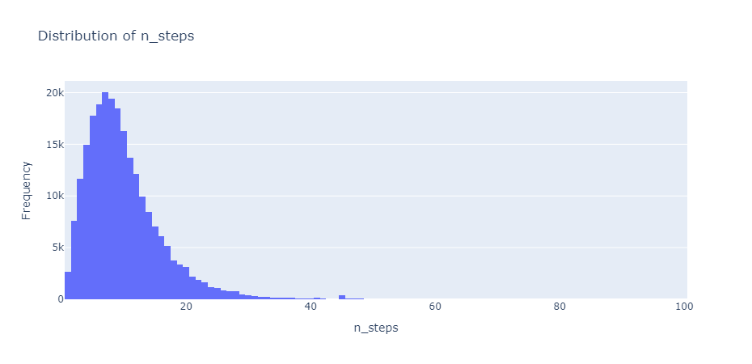
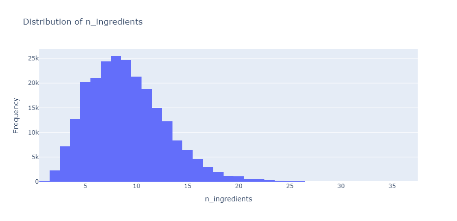
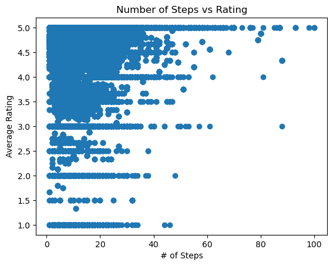
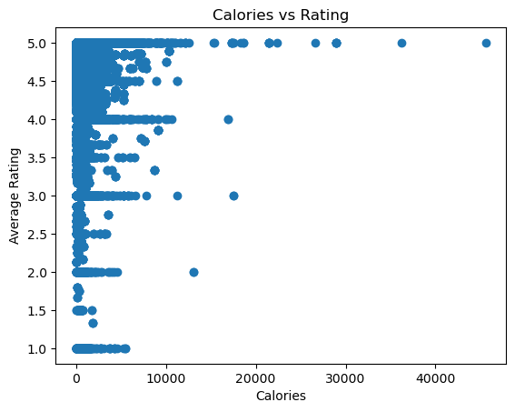
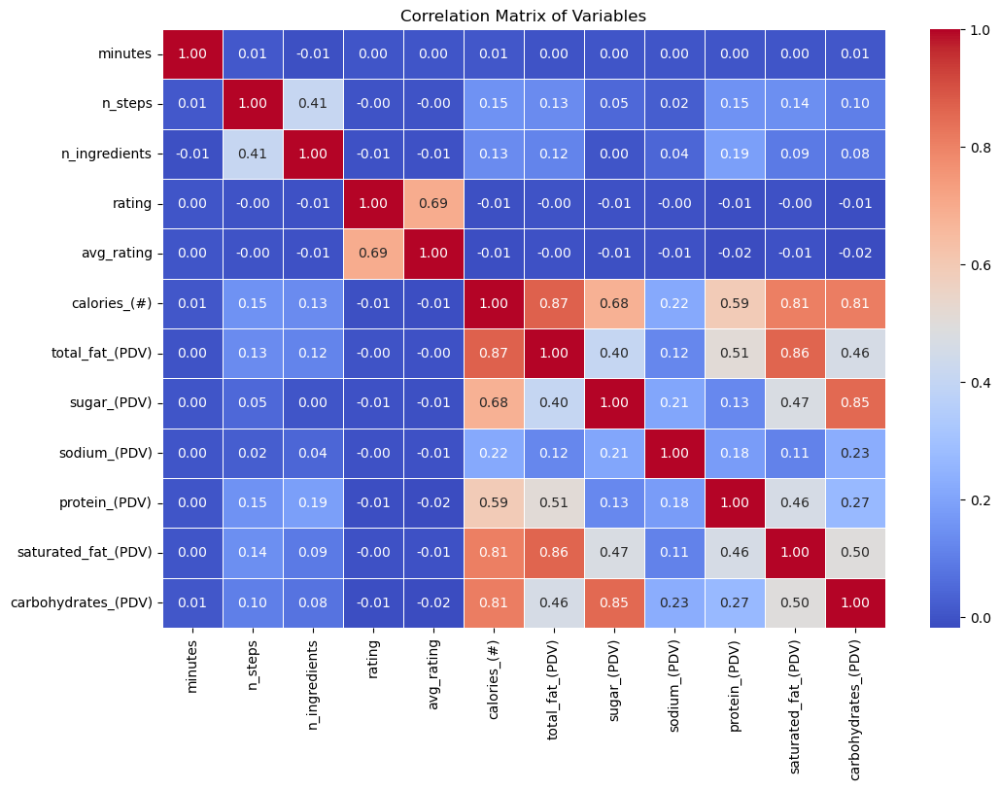
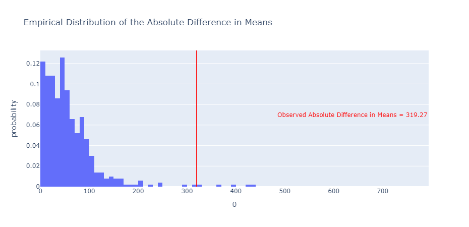

# Understanding Ratings Based on Nutrition and Number of Ingredients

## Authors
- Pratham Mittal  
- Ryosuke Oguchi  
- Chaklam Ng  

---

## 📌 Abstract

This study investigates the relationship between recipe characteristics, nutritional content, and user ratings to identify key factors that influence perceived recipe quality. Using Food.com datasets, we examine the impact of ingredient count, preparation steps, and nutritional components (calories, fats, sugars, etc.) on user ratings. Insights from this analysis help understand user preferences and guide recipe development.

---

## 📁 Dataset

### Data Sources

Two CSV files from [Food.com](https://www.kaggle.com/datasets) were used:

#### `recipes.csv`
| Column          | Description                                                                 |
|-----------------|-----------------------------------------------------------------------------|
| name            | Recipe name                                                                |
| id              | Recipe ID                                                                  |
| minutes         | Minutes to prepare the recipe                                              |
| contributor_id  | ID of the user who submitted the recipe                                    |
| submitted       | Date the recipe was submitted                                              |
| tags            | Food.com tags for the recipe                                               |
| nutrition       | `[calories, total fat, sugar, sodium, protein, saturated fat, carbohydrates]` |
| n_steps         | Number of preparation steps                                                |
| steps           | List of preparation steps                                                  |
| description     | Recipe description                                                         |

#### `interactions.csv`
| Column     | Description               |
|------------|---------------------------|
| user_id    | ID of the reviewer        |
| recipe_id  | Corresponding recipe ID   |
| date       | Review date               |
| rating     | User rating (1-5)         |
| review     | User-written review       |

---

## 🔍 Exploratory Data Analysis (EDA)

The datasets were merged on `recipe_id` and cleaned. The following steps were taken:

- Parsed and expanded the nutrition column into individual features.
- Converted step and tag data into proper list format using `ast.literal_eval`.
- Created a new `avg_rating` column per recipe.
- Converted missing ratings to 0 where applicable.

### 📈 Univariate Analysis

**Number of Steps per Recipe:**

Most recipes have fewer than 20 steps, with a median around 8.

**Number of Ingredients:**

Most recipes use 5–15 ingredients. Recipes with more than 25 ingredients are considered outliers.

---

### 📊 Bivariate Analysis

**Average Rating vs. Number of Steps:**

No strong trend was observed, though extremely long recipes often scored a 5.

**Average Rating vs. Calories:**

Again, no strong correlation was found.

---

### 🔗 Correlation Matrix (Heatmap)

A heatmap was generated to explore inter-feature correlations.

Most features showed weak correlations with `avg_rating`.

---

### 🧩 Missing Data Analysis

Using a permutation test:

- Null Hypothesis: Distribution of calories is the same with or without reviews.
- p-value = 0.002 → Statistically significant difference.
- Conclusion: The missingness in `review` column depends on `calories`.

---

## 🧪 Hypothesis Testing

> **Question**: Do people rate recipes the same regardless of complexity?

- Null Hypothesis: No relationship between `avg_rating` and `n_steps`
- Alternate Hypothesis: There is a relationship
- p-value = 0.726 → Fail to reject the null hypothesis

### 🔍 Insight

Recipe complexity (measured by steps) does **not** significantly influence user ratings.

---

## 📈 Regression Analysis

### Linear & Polynomial Models

- Simple and multiple linear regressions were applied.
- Polynomial terms tested for non-linearity.
- Results showed **very weak predictability**:
  - R² ≈ 0.001

### Multicollinearity

- VIF scores were acceptable.
- However, large condition numbers suggested model instability.

---

## ⚙️ Model Selection

### Methods Used

- Forward Selection
- Backward Selection
- Mixed Selection

| Method             | Selected Variables         | R²     | Insight                                          |
|--------------------|----------------------------|--------|--------------------------------------------------|
| Forward Selection  | calories, protein, carbs   | ~0.001 | Variables statistically significant, but weak    |
| Backward Selection | Same as above              | ~0.001 | No new variables added                           |
| Mixed Selection    | Additional variables (insignificant) | ~0.001 | Did not improve model performance                |

---

## 📌 Key Takeaways

- **No strong predictors** of average rating found among nutritional and step-related variables.
- Some high-rated recipes are outliers with large servings, possibly skewing results.
- Suggests subjective factors (taste, appearance, cultural preference) are more impactful.

---

## 🔄 Recommendations

- **Include qualitative data** like review sentiment or tags.
- Use **advanced ML models** to capture complex patterns.
- Consider **user segmentation** to uncover personalized trends.

---

## 🧾 Conclusion

While the idea of predicting recipe ratings using nutritional and structural data is compelling, the analysis reveals that such features alone are insufficient. Human taste is nuanced, and user ratings likely depend on more subjective elements not captured here.

---

## 📚 References

- Food.com Dataset: [Kaggle Link](https://www.kaggle.com/datasets)
- Related Project: [Text Analytics on Food.com](https://github.com/kbpavan/Text-Analytics-on-Food.com-Recipes-Review-Data-)
